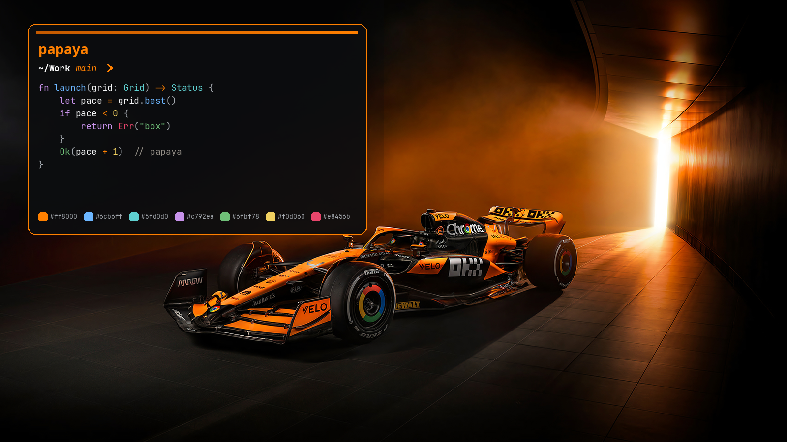

# Papaya



McLaren F1 theme for [Omarchy](https://omarchy.org/). Cool carbon black, with papaya `#ff8000` as the accent for the shell, window borders, terminals, Chrome, OpenCode, and the other apps Omarchy themes from `colors.toml`.

Code keeps its own hues on that carbon: sky blue, cyan, and violet, with gold for warnings and rose for errors. Papaya stays the accent, the orange, and the operator color.

## Install

```bash
omarchy theme install https://github.com/maplepreneur/Papaya.git
~/.config/omarchy/themes/papaya/bin/install-logo
```

Omarchy names the theme `papaya` from this repository. The second command puts the speedmark on the bar and installs the screensaver, the prompt, and the OpenCode theme.

On the gallery, `omarchy theme install papaya` installs the palette, wallpapers, icon color, Chrome seed, and shell controls. That checkout leaves out `bin/`, so the logo, screensaver, prompt, and OpenCode theme still come from the commands above.

Turn on the update hook once, in the installed copy:

```bash
git -C ~/.config/omarchy/themes/papaya config core.hooksPath .githooks
```

## Bar logo and screensaver

The speedmark is in `logo/`, and the screensaver art is `screensaver.txt`. Omarchy's installer applies colors and wallpapers. It does not run a script from the theme, so the logo, screensaver, prompt, and OpenCode theme need one command on a new machine:

```bash
omarchy theme install https://github.com/maplepreneur/Papaya.git
~/.config/omarchy/themes/papaya/bin/install-logo
```

That replaces the Omarchy mark on the left of the bar and installs the screensaver. Left click still opens the menu. Right click still opens a terminal. The same command installs the Papaya prompt and points OpenCode at `opencode/papaya.json`.

The command also registers a theme hook. After that, `omarchy theme install` and `omarchy theme set papaya` apply the logo, screensaver, prompt, and OpenCode theme themselves, because both finish by setting the theme. Choosing another theme puts back the prompt and OpenCode theme that were in place before Papaya, when those were saved.

Selected text on web pages is papaya `#ff8000` with carbon text. Chrome’s address bar and the selected settings row are papaya as well. The address-bar selection follows `chromium.theme` (`14,12,11`), a near-carbon seed, so the window stays dark and that highlight is papaya with white text. The settings row is `#ff8000` with dark text. `bin/papaya-chrome` paints the row, and the installer registers it as the Chrome launcher. The first launch compiles a small helper with `gcc`. Without `gcc`, Chrome still opens and the settings row keeps Chrome’s own color. Quit Chrome and open it again after installing or updating the theme. An open window keeps the previous colors until then.

## Update

```bash
omarchy theme update
```

That pulls every theme you installed from git. When Papaya is the active theme, the hook refreshes the desktop from this repo. New wallpapers stay on disk. The current wallpaper is left where it is.

All seven wallpapers are McLaren Formula 1 photographs, restored with [Upscayl](https://upscayl.org/) so the JPEG softness is cleaned up and a 2880×1920 panel is covered. 01, 04, 05, and 06 are twice the original size. 02, 03, and 07 stay at their original size. The photographs are included so the theme installs with its own backgrounds.

`colors.toml` is the palette. Omarchy Quattro builds the terminal, editor, shell, and lock screen from it. Active window borders run from deep papaya `#c45a00` into `#ff8000`. `chromium.theme` is shipped on purpose: the generated file would be the carbon background, and Chrome treats that as a blue-tinted seed, so the address bar stays blue. `shell.controls.toml` is merged on top when the theme is applied: idle controls are carbon with a papaya border, and hover, focus, and the chosen control are a light papaya wash (`selected-fill-alpha` 0.22) with that same border. `shell.lock.toml` is the lock screen: a carbon field, a papaya border that brightens while typing, and rose for a wrong password. The prompt in `starship.toml` is white for the path and git status, papaya for the branch and the chevron, and rose for a failed command. Do not commit other generated app configs into this repo.

## License

MIT. See [LICENSE](LICENSE).
